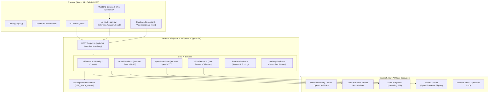

# PlacePrep System Architecture

---

## 1. Core AI Capabilities

### Feature 1: AI Placement Chatbot (RAG Grounding)
1. **User Query**: Student submits conceptual or technical placement questions.
2. **Hybrid Retrieval**: `searchService` queries indexed documents (`placement-knowledge-index`) or local markdown knowledge bases using hybrid semantic + keyword search.
3. **Context Injection**: Relevant document chunks are injected into the system prompt.
4. **Verified Generation**: Azure OpenAI / Microsoft Foundry agent generates technical explanations complete with code snippets, complexity trade-offs, and source citations.

### Feature 2: AI Mock Interview (Speech + Vision + AI Evaluation)
1. **Camera Feed**: Browser streams candidate video locally via WebRTC.
2. **Defensible Vision Signals**: `visionService` monitors candidate presence and camera framing. **Strictly rejects emotion, honesty, confidence, or mental state inference**.
3. **Voice STT**: Student speaks into microphone; Web Speech API and Azure AI Speech transcribe the spoken response in real-time.
4. **Evaluation Engine**: `interviewService` evaluates candidate transcripts against curated rubrics, outputting Technical Knowledge (0-100), Answer Relevance (0-100), and Communication (0-100).
5. **Report Synthesis**: Produces strengths, areas to improve, recommended follow-ups, and question-by-question reviews.

### Feature 3: Personalized Placement Roadmap Generator
1. **Constraint Input**: Student specifies target role, skill baseline, daily hours, duration (30/45/60/90 days), and focus topics.
2. **Curriculum Synthesis**: `roadmapService` constructs a day-by-day, multi-week curriculum.
3. **Interactive Tracking**: Student checks off completed tasks with dynamic progress recalculation and direct links to relevant chatbot study notes.

---

## 2. Responsible AI Framework

- **Transparency**: Clear "AI Disclaimer" on all generated interview evaluations and roadmaps.
- **Fairness & Privacy**: Camera analysis is purely operational (presence & framing) and does not store biometric signatures or assess psychology.
- **Grounding**: Chatbot responses cite verified curriculum sources to minimize hallucinations.
